# MSE-CNN Implementation

  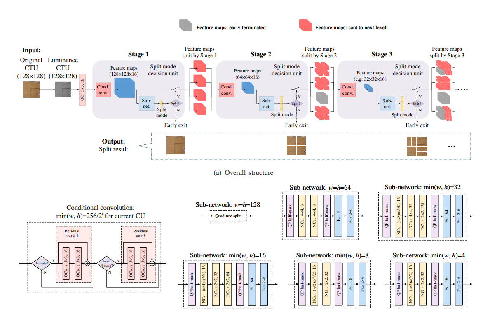
  
MSE-CNN model

<!-------->

Code database with an implementation of MSE-CNN [1]. Besides the code, the dataset and coefficients obtained after training are provided.
 
 

- [MSE-CNN Implementation](#mse-cnn-implementation)
  - [Introduction](#introduction)
  - [Theorectical Background](#theorectical-background)
    - [Partitioning in VVC](#partitioning-in-vvc)
    - [MSE-CNN](#mse-cnn)
      - [Architecture](#architecture)
      - [Loss Function](#loss-function)
      - [Training](#training)
      - [Implementation remarks](#implementation-remarks)
  - [Dataset](#dataset)
  - [Results](#results)
    - [F1-score, Recall and Precision](#f1-score-recall-and-precision)
    - [Confusion matrices](#confusion-matrices)
      - [Stages 2 and 3](#stages-2-and-3)
      - [Stages 4 and 5](#stages-4-and-5)
      - [Stage 6](#stage-6)
    - [Y-PSNR, Complexity Reduction and Bitrate](#y-psnr-complexity-reduction-and-bitrate)
  - [Relevant Folders and files](#relevant-folders-and-files)
    - [Folders](#folders)
    - [Files](#files)
  - [Installation of dependencies](#installation-of-dependencies)
  - [Contributions](#contributions)
  - [License](#license)
  - [References](#references)

<!--------- Put demo here ----------->

## Introduction

The emergence of new technologies that provide creative audiovisual experiences, such as 360-degree films, virtual reality, augmented reality, 4K, 8K UHD, 16K, and also with the rise of video traffic on the web, shows the current demand for video data in the modern world. Because of this tension, Versatile Video Coding (VVC) was developed due to the the necessity for the introduction of new coding standards. Despite the advancements achieved with the introduction of this standard, its complexity has increased very much. The new partitioning technique is responsible for majority of the increase in encoding time. This extended duration is linked with the optimization of the Rate-Distortion cost (RD cost). Although VVC offers higher compression rates, the complexity of its encoding is high.

  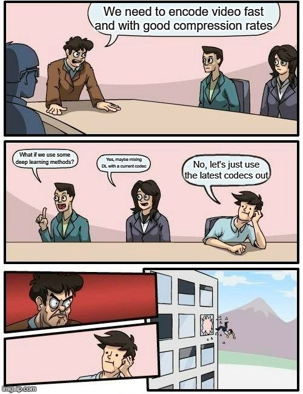
  
VVC Complexity

In light of this, the Multi-Stage Exit Convolutional 
Neural Nework (MSE-CNN) was developed. This Deep Learning-based model is organised in a sequential structure with several stages. Each stage, which represents a different partition depth, encompasses a set of layers for extracting features from a Coding Tree Unit (CTU) and deciding how to partition it. Instead of using recursive approaches to determine the optimal way to fragment an image, this model allows VVC to estimate the most appropriate way of doing it. **This work presents a model of the MSE-CNN that employs training procedures distinct from the original implementation of this network, as well as the ground-thruth to train and validate the model and an interpretation of the work done by the MSE-CNN’s original creators**.

  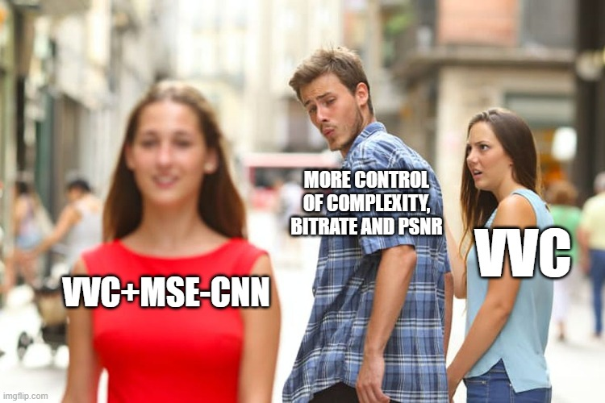
  
MSE-CNN benefits

## Theorectical Background

### Partitioning in VVC

The key objective of partitioning is to divide frames into pieces in a way that results in a
reduction of the RD cost. To achieve a perfect balance of quality and bitrate, numerous image
fragments combinations must be tested, which is computationally expensive. Due to the intensive
nature of this process, a high compression rate can be attained. Partitioning contributes heavily
to both the complexity and compression gains in VVC. H.266 (VVC), organize a video sequence in many frames that are divided into smaller pieces. First, pictures are split into coding tree units (CTUs), and then they are divided into coding units (CUs). For the luma channel, the largest CTU size in
VVC is 128x128 and the smallest is 4x4. In VVC, a quad-tree (QT) is initially applied to the CTUs in the first level, and then a quad-tree with nested multi-type tree (QMTT) is applied recursively. 

  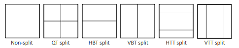
  
Types of partitions in VVC

This innovation makes it possible to split CUs in different rectangle forms. Splitting a CU into:

* three rectangles with a ratio of 1:2:1 results in a ternary tree (TT), with the center rectangle being half the size of the original CU; when applied horizontally it is called a horizontal ternary tree (HTT), and vertical ternary tree (VTT) when it is done vertically. 
* two rectangles results in a binary tree (BT)partition, a block with two symmetrical structures; like in the case of the TT, depending on the way the split is done, it can be called either
a vertical binary tree (VBT) or a horizontal binary tree (HBT).

The association of BT and TT is named a multi-type tree (MTT). The introduction of BT and TT partitions enables the creation of various new types of forms, with heights and widths that can be a combination between 128, 64, 32, 16, 8 and 4. The increased number of possible CUs boosts the ability of the codec to fragment
an image more efficiently, allowing better predictions and higher compressing abilities. Although this standard now have these advantages, as a downside it takes longer to encode.

  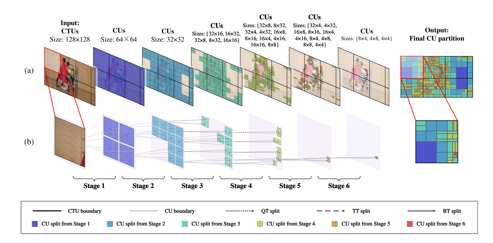
  
Partitioning in VVC

### MSE-CNN

Multi-Stage Exit Convolutional Neural Network (MSE-CNN) is a DL model that seeks to forecast CUs in a waterfall architecture (top-down manner), it integrates . This structure takes a CTU as input, extracts features from it, splits the CU into one of at most six possible partitions (Non-split, QT, HBT, VBT, HTT, and VTT), and then sends it to the next stage. This model has CTUs as inputs in the first stage, either in the chroma or luma channel, and feature maps in the subsequent stages. Furthermore, it generates feature maps and a split decision at each level. In the event that one of the models returns the split decision as Non-Split, the partitioning of the CU is ended immediately.

  
  
MSE-CNN

#### Architecture

This model is composed by the following blocks:

* Initially, this model adds more channels to the input of this network to create more features
from it; this is accomplished by utilising simple convolutional layers. 

  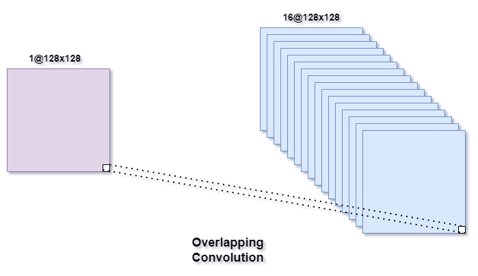
  
Overlapping convolution layer

* To extract more characteristics from the data, the information is then passed through a series of convolutional layers; these layers were named Conditional Convolution. 
  

  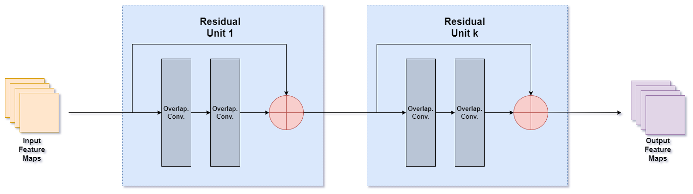
  
Conditional Convolution

* At the end, a final layer is employed to determine the
optimal manner of partitioning the CU. This layer is a blend of fully connected and convolutional
layers.

  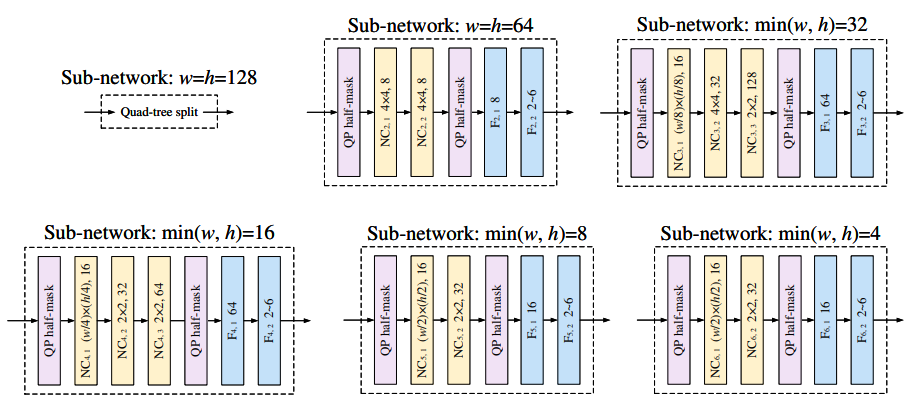
  
Sub-networks

Note: For more details regarding these layers check [1]
 

#### Loss Function

The loss developed for the MSE-CNN is the result of two other functions, as defined in the
following expression:

$$ L = L_{CE}+\beta L_{RD}$$

In the above equation, $\beta$ is a real number to adjust the influence of the $L_{RD}$ loss. The first member of this loss function is a modified Cross-Entrotopy loss, developed to solve imbalanced dataset issues:

$$L_{CEmod} = -\frac{1}{N}\sum_{n=1}^N \sum_{m\varepsilon Partitions}(\frac{1}{p_m})^\alpha y_{n, m}\log(\hat{y}_{n, m})$$

  
In this equation "n" is the batch number, "m" is the corresponding partition (0 (Non-Split), 1 (QT), 2 (HBT), 3 (VBT), 4 (VTT), 5 (HTT)), N is the total number of batches and alpha is a parameter to configure the penalties for the less represented classes
 

 
 

Concerning the second member of the MSE-CNN loss function, this constituent gives the network the ability to also make predictions based on the RD Cost.

$$L_{RD} = \frac{1}{N}\sum_{n=1}^N \sum_{m\varepsilon Partitions}\hat{y}_{n, m}\frac{r_{n, m}}{r_{n, min}}-1$$

In the above equation, the RD costs $r_{n, m}$ uses the same notation for "n" and "m" as the previous equation. Regarding $r_{n ,min}$, it is the minimal RD cost for the nth CU among all split modes and 
$$\frac{r_{n, m}}{r_{n, min}} - 1$$
is a normalised RD cost. As a relevant note, $r_{n, min}$ is equal to the RD cost of the best partition mode. Consequently, the result of

$$\hat{y}_{n, m}\frac{r_{n, m}}{r_{n, min}}-1$$ 

ensures that CU's partitions with greater erroneously predicted probability values or greater RD cost values $r_{n, m}$ are more penalised. In $\frac{r_{n, m}}{r_{n, min}} - 1$, the ideal partition has a normalised RD cost of zero, but the other partitions do not. Therefore, the only way for the loss to equal zero is if the probability for all other modes also equals zero. Consequently, the learning algorithm must assign a greater probability to the optimal split mode while reducing the probabilities for the rest. **Experimentally it was verified that this function wasn't able to contribute to the training of the MSE-CNN, this contradicted the remarks made in [1]**.

#### Training

The strategy used to train the MSE-CNN was very similar to the one used in [1]. The first parts of the model to be trained were the first and second stages, in which 64x64 CUs were passed through the second depth. Afterwards, transfer learning was used to pass certain coefficients of the second stage to the third. Then, the third stage was trained with 32x32 CUs flowing through it. After this step, a similar process was done to the following stages. It is worth noting that, beginning with stage 4, various CUs forms are at the models' input. This means that these stages were fed different kinds of CUs.  

  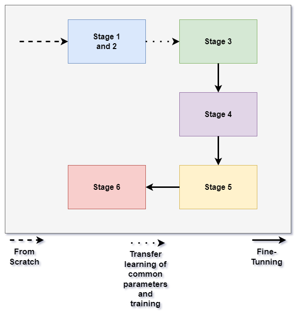
  
Training flow used

At the end of training, 6 models were obtained one for each partitioning depth in the luma channel. Although models for the luma and chroma channels could be created for all the shapes of CUs that are possible, rather than just for each depth, only six were trained for the sake of assessing the model behaviour in a simpler and more understandable configuration.

#### Implementation remarks

Due to the deterministic nature of the first stage, where CTUs are always partitioned with a QT, it was implemented together with the second stage. If it was done separately, the training for the first two stages would have to be done at the same time. Consequently, two distinct optimisers would need to be employed, which could result in unpredictable training behaviour.  

  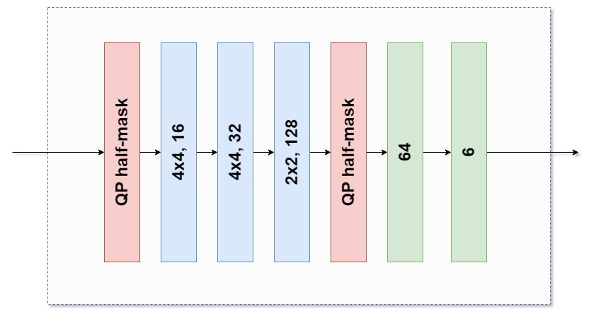
  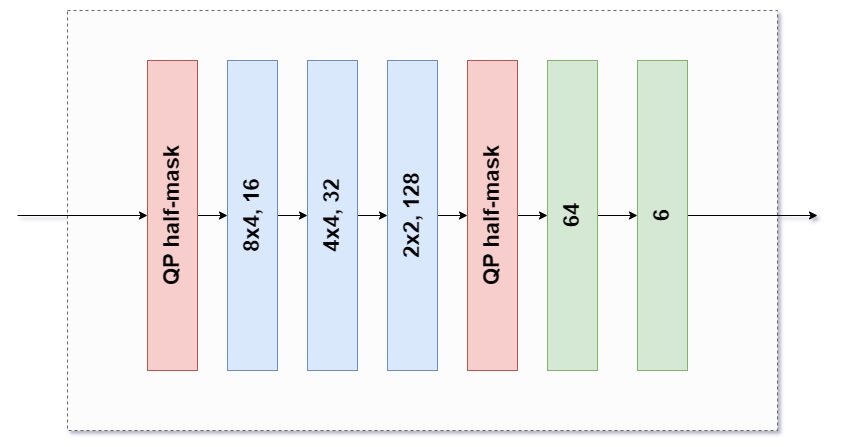
  
32 minimum axis size sub-networks

When implementing the sub-networks on code, those that were meant to cater for varying CU sizes were further implemented separately. For example, in the case of the sub-network utilised when the minimum width or height is 32, two variants of the first two layers were built. This was done because 64x32 and 32x32 CUs can flow across this block. Because of this, the first two layers were implemented separately from the entire block. Then, they were used in conjunction with the remaining layers based on the dimensions of the input CU. The same procedures were followed for the other types of sub-networks.

When the network was being trained, some of the RD costs from the input data had very high values. Consequently, the RD loss function value skyrocketed, resulting in extremely huge gradients during training. As a result, the maximum RD cost was hard coded at $10^{10}$. This amount is large enough to be more than the best partition's RD cost and small enough to address this issue. 

## Dataset

Please see this [page](RAISE_TEST/README.md) to understand better the dataset and also access it.

## Results

Since it was verified that the Rate-Distortion Loss. $L_{RD}$, could contribute for better results, the metrics presented here were obtained with a model trained only with the modified cross-entropy loss.

###  F1-score, Recall and Precision

| Stage | F1-Score | Recall | Precision |
|-------|----------|--------|-----------|
| Stage 2 | 0.9111 | 0.9111 | 0.9112 |
| Stage 3 | 0.5624 | 0.5767 | 0.5770 |
| Stage 4 | 0.4406 | 0.4581 | 0.4432 |
| Stage 5 | 0.5143 | 0.5231 | 0.5184 |
| Stage 6 | 0.7282 | 0.7411 | 0.7311 |

Results with weighted average for F1-score, recall and precision.

### Confusion matrices

#### Stages 2 and 3

  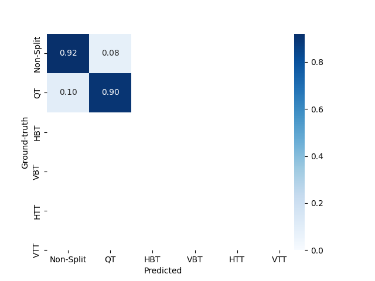
  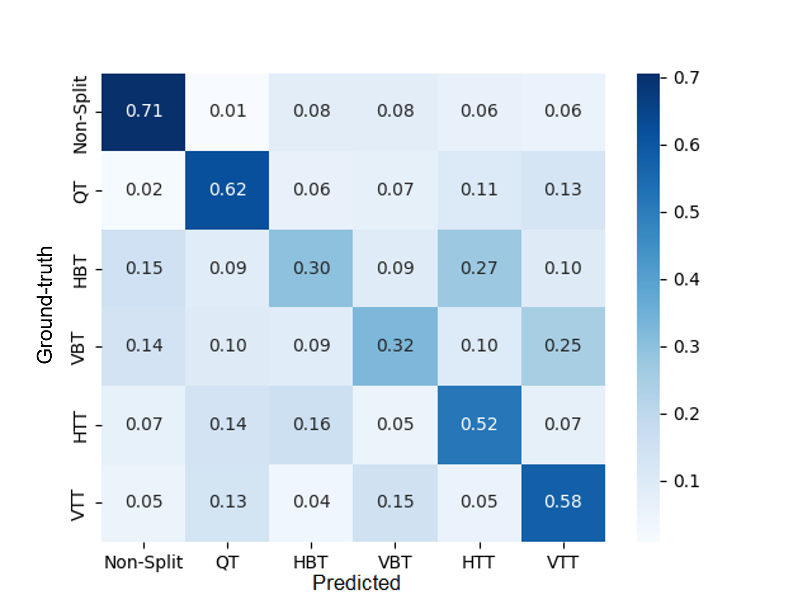
  
Confusion matrix results in with the testing data in stages 2 and 3

#### Stages 4 and 5

  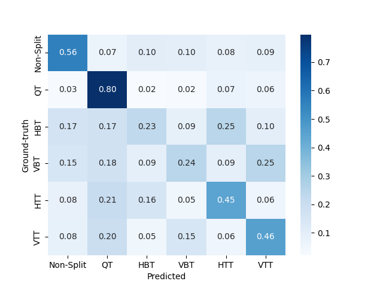
  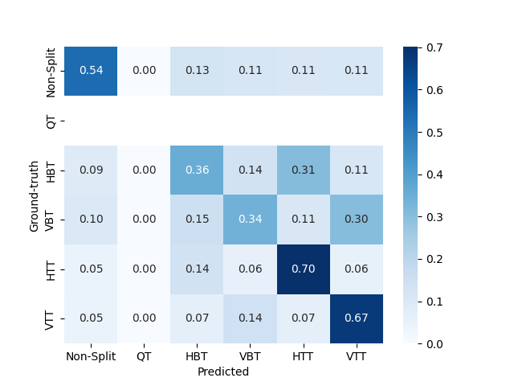
  
Confusion matrix results in with the testing data in stages 4 and 5

#### Stage 6

  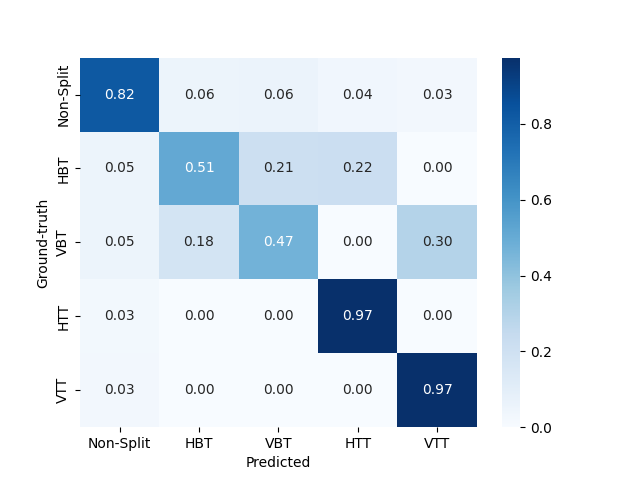
  
Confusion matrix results in with the testing data in stage 6

### Y-PSNR, Complexity Reduction and Bitrate

| Metric | VTM-7.0 | VTM-7.0+Model | Gain |
|-------|----------|--------|-----------|
| Bitrate | 3810.192 kbps | 4069.392 kbps | 6.80% |
| Y-PSNR | 35.7927 dB  | 35.5591 dB | -0.65% |
| Complexity | 1792.88 s  | 1048.95 s | -41.49% |

**These results were obtained with the "medium" configuration for the multi-thresholding method.**

## Relevant Folders and files

### Folders

| Folder | Description |
|--------|-------------|
| [dataset_RAISE_TEST](dataset_RAISE_TEST) | This folder contains all of the dataset and all of the data that was processed in order to obtain it |
| [example_data](example_data) | Here you can find some example data that it is used for the scripts in usefull_scripts folder|
| [model_coefficients](model_coefficients) | The last coefficient obtained during training, as well as the best one in terms of the best F1-score obtained in testing data |
| [usefull_scripts](usefull_scripts) | Some example scripts demonstrating how to use some of the functions created can be found here |

### Files

| Files | Description |
|--------|-------------|
| constants.py | Constant values used in other python files |
| CustomDataset.py | Dataset class to handle the files with the ground-thruth information, as well as other usefull classes to work together with the aforementioned class |
| dataset_utils.py | Functions to manipulate and process the data, also contains functions to interact with YUV files |
| MSECNN.py | MSE-CNN and Loss Function classes implementation |
| train_model_utils.py | Usefull functions to be used during training or evaluation of the artificial neural network |
| utils.py | Other functions that are usefull not directly to the model but for the code implementation itself |

## Installation of dependencies

In order to run this project, it is needed to first install of the libraries used in it. For this please follow the below steps:
1. Create a virtual environment to do install the libraries; follow this [link](https://www.geeksforgeeks.org/creating-python-virtual-environment-windows-linux/) in case you don't know how to do it; you possibly need to install [pip](https://www.makeuseof.com/tag/install-pip-for-python/), if you don't have it installed
2. Run the following command:   <code>pip install -r requirements.txt</code>  
This will install all of the libraries references in the requirements.txt file.
3. Enjoy! :)

## Contributions

Feel free to contact me through this [email](raudao@hotmail.com) or create either a issue or pull request to contribute to this project ^^.

## License

This project license is under the [**MIT License**](LICENSE).

## References
[1] T. Li, M. Xu, R. Tang, Y. Chen, and Q. Xing, [“DeepQTMT: A Deep Learning Approach for
Fast QTMT-Based CU Partition of Intra-Mode VVC,”](https://arxiv.org/abs/2006.13125) IEEE Transactions on Image Processing,
vol. 30, pp. 5377–5390, 2021, doi: 10.1109/tip.2021.3083447.

  
  
:)

