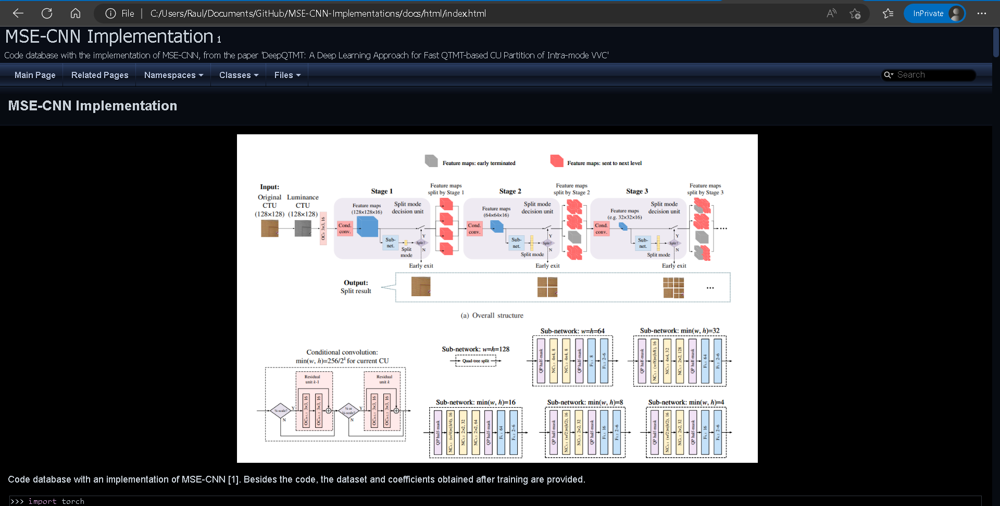

# Documentation

In order to see the documentation, first choose the method to visualize it (html, latex or xml) and then open the index file (index.html, index.tex, index.xml). Regarding the index.html you can drag this file and release in your browser to visualize it.

